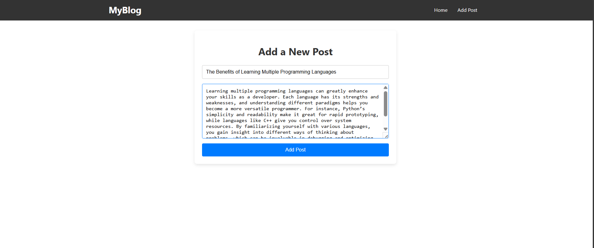
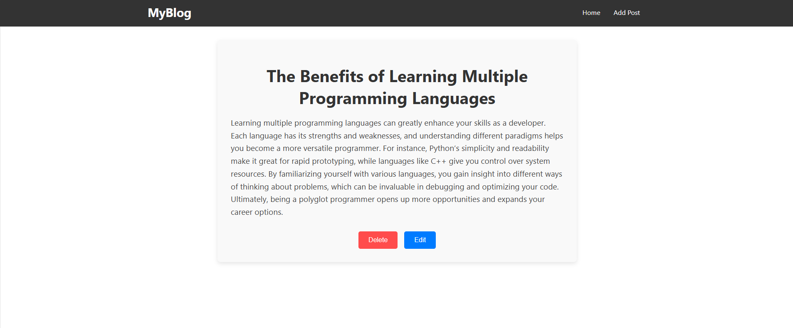

# Blog Application

This is a simple blog application built using React, allowing users to create, read, update, and delete blog posts. The application utilizes a RESTful API to manage blog post data.

## Features

- **Create Blog Posts**: Users can add new blog posts with a title and content.
- **View Blog Posts**: All blog posts are displayed on the home page, with links to view individual posts.
- **Edit Blog Posts**: Users can edit existing posts.
- **Delete Blog Posts**: Users can delete posts.
- **Responsive Design**: The application is designed to be responsive and user-friendly.

## Technologies Used

- **Frontend**: React, Axios, React Router
- **Backend**: Node.js, Express.js, MongoDB (for storing blog post data)

## Getting Started

### Prerequisites

- Node.js and npm installed on your machine.
- MongoDB installed and running on your local machine.

### Installation

1. Clone the repository:

   ```bash
   git clone https://github.com/Jay-Dalsaniya/blog-app.git
   cd blog-app
   ```

2. Install the dependencies for the client:

   ```bash
   cd client
   npm install
   ```

3. Install the dependencies for the server:

   ```bash
   cd ../server
   npm install
   ```

4. Set up the database connection:
   - Ensure your MongoDB server is running.
   - Update the connection string in the server's configuration file to point to your MongoDB instance.

### Running the Application

1. Start the server:

   ```bash
   cd server
   node index.js
   ```

2. In another terminal, start the client:

   ```bash
   cd ../client
   npm start
   ```

3. Open your browser and go to `http://localhost:3000` to view the application.

## Folder Structure

```
/blog-app
│
├── /client           # Frontend code
│   ├── /src          # Source files
│   ├── /components   # React components
│   ├── /pages        # Page components
│   └── /styles       # CSS styles
│
├── /server           # Backend code
│   ├── /models       # Mongoose models
│   ├── /routes       # API routes
│   ├── /controllers  # Route controllers
│   └── index.js      # Server entry point
│
└── README.md         # Project documentation
```

## Usage

- To add a new blog post, click on the "Add Post" link.
- To view a blog post, click on its title from the blog list.
- You can edit or delete a post from the individual post page.

## Screenshots

### Home Page


_The main landing page displaying the list of blog posts._

### Add Post


_The form used to create a new blog post._

### Show Post


_The view for an individual blog post, displaying its title and content._

### Update Post


_The form for editing an existing blog post._

### Delete Post


_The confirmation dialog for deleting a blog post._
```
